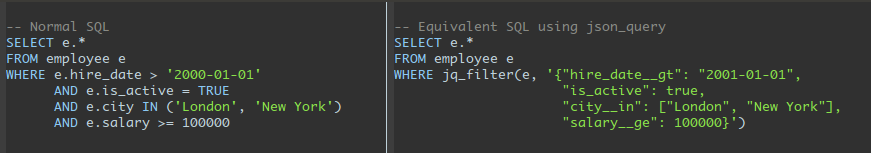

# json_query

Use JSON objects to generate SQL ```WHERE``` clause expressions.



## Installation

Clone this repo and from within the base directory, run

```
>>> make install
```

to install the JSON_QUERY PostgreSQL extension. Once this is done, the extension can be added
to a database via [PostgreSQL's `CREATE EXTENSION`](https://www.postgresql.org/docs/9.6/static/sql-createextension.html):

```SQL
template1=# CREATE EXTENSION json_query;
```

## Overview

PostgreSQL provides no simple way to parameterize a query's ```WHERE``` clause
which severly limits the reusability of many types of SQL functions.

For example, given a table tracking customer purchases, it might be useful to
create a function that returns the total of all outstanding amounts:

```SQL
CREATE FUNCTION total_outstanding() RETURNS NUMERIC AS $$
  SELECT SUM(outstanding_amount)
  FROM purchase
  WHERE NOT written_off;
$$ LANGUAGE SQL STABLE;
```

It might also be useful to apply some restrictions on the purchases included in the sum:

```SQL
-- Includes only purchases made on or after the given date
CREATE FUNCTION total_outstanding_since(since_date DATE) RETURNS NUMERIC AS $$
  SELECT SUM(outstanding_amount)
  FROM purchase
  WHERE NOT written_off AND purchase_date >= since_date;
$$ LANGUAGE SQL STABLE;

-- Includes only purchases made by the specified customer
CREATE FUNCTION total_outstanding_for_customer(cid TEXT) RETURNS NUMERIC AS $$
  SELECT SUM(outstanding_amount)
  FROM purchase
  WHERE NOT written_off AND customer_id = cid;
$$ LANGUAGE SQL STABLE;

-- ... Etc.
```

Creating all of these repetitive variations on a function is tiresome and so applications will
typically construct the query using some programming language specific query-builder.

Query-builders complicate SQL development by forcing database interaction to take place via the
client language and make debugging/profiling more difficult since they must deal with programmatically
generated queries.

This extension provides an alternative by allowing the `WHERE` part of a query to be parameterized:

```SQL
-- This procedure takes an optional argument customizing which rows are included in the aggregate.
CREATE FUNCTION total_outstanding(filters JSONB DEFAULT '{}') RETURNS NUMERIC AS $$
  SELECT SUM(outstanding_amount)
  FROM purchase p
  WHERE NOT written_off AND jq_filter(p, filters);
$$ LANGUAGE SQL STABLE;
```

This function replaces all of the previous functions:

```SQL
-- Equivalent to the original total_outstanding() procedure:
SELECT total_outstanding('{}');

-- Equivalent to total_outstanding_since_date('2015-01-01'):
SELECT total_outstanding('{"purchase_date__ge": "2015-01-01"}');

-- Equivalent to total_outstanding_for_customer('a'):
SELECT total_outstanding('{"customer_id": "a"}');
```

And can also perform more complex variations of the original query:

```SQL
-- Total outstanding payments due from customers 'a' or 'b' for purchases on
-- or after Jan. 1, 2015:
SELECT total_outstanding('{"purchase_date__ge": "2015-01-01",
                           "customer_id__in": ["a","b"]}');
```

## API

### `jq_register_row_type(type_name TEXT)`
Before any table (or other composite types) can be used with JSON_QUERY, they must first be registered
with this function. `type_name` should be the full name of the table (i.e., `'schema_name.table_name'`
if the table is not in the public schema; otherwise, simply `'table_name'`).

### `jq_unregister_row_type(type_name TEXT)`
Unregister a previously registered row type.

**NOTE**: If the table definition of a previously registered table changes, it should be unregistered
and then registered again.

### `jq_filter(rec ANYELEMENT, filter_object JSONB)`
Returns a boolean indicating whether or not the record matched against the filter object. `rec` should
be a row value previously registered via `jq_register_row_type()`. `filter_object` should be a JSONB
object specifying a where-clause using Django-style filter syntax.

### `jq_filter_raw(rec ANYELEMENT, raw_filter_array JSONB)`
Performs a filter using a JSONB array of raw filter objects. The raw filter format is more verbose than
the Django filter syntax but more flexible.

#### Django-style filter objects
A *Django-style* filter object is a JSONB object of the form `{"<column>__<op>": <value>, ...}` generating
a whereclause similar to `WHERE <column> <op> <value> AND ...`.

#### Filter arrays
This is the internal format, which is exposed in the API as it is easier to work with programmatically.
These should be JSONB arrays of objects of the form `[{"field": "<column>", "op": "<op>", "value": <value>}, ...]`
and generate a whereclause similar to `WHERE <column> <op> <value> AND ...`.

#### Available operators
The allowed values for the `<op>` expression (and the SQL operator they represent) are as follows:
 * `eq` (`=` when value is non-NULL, `IS` for NULL value)
 * `ne` (`<>` when vaue is non-NULL, `IS NOT` for NULL value)
 * `gt` (`>`)
 * `lt` (`<`)
 * `le` (`<=`)
 * `ge` (`>=`)
 * `in` (`IN`)
 * `notin` (`NOT IN`)
 * `like` (`LIKE`)
 * `ilike` (`ILIKE`)
 * `startswith` (equivalent to `<column> LIKE '<value>%'`)
 * `istartswith` (equivalent to `<column> ILIKE '<value>%'`)
 * `endswith` (equivalent to `<column> LIKE '%<value>'`)
 * `iendswith` (equivalent to `<column> ILIKE '%<value>'`)
 * `exists` (`?`)
 * `notexists` (equivalent to `NOT (<column> ? <value>)`)
 * `existsany` (`?|`)
 * `notexistsany` (equivalent to `NOT (<column> ?| <value>)`)
 * `existsall` (`?&`)
 * `notexistsall` (equivalent to `NOT (<column> ?& <value>)`)
 * `contains` (`@>`)
 * `contained` (`<@`)

#### Nested JSONB-column lookups
In the case of JSONB columns, the `<column>` argument can reference a value nested within the JSONB object
via the [JSONB lookup operators](https://www.postgresql.org/docs/9.6/static/functions-json.html#FUNCTIONS-JSON-OP-TABLE)
`->` (lookup as JSONB) or `->>` (lookup as TEXT).


## Performance

All queries made using ```jq_filter()``` are simplified by Postgres'
query optimizer to the same expression as would be used with the equivalent
inline query. So the only performance difference between jq_filter()
and its inline equivalent is the time it takes the query optimizer to simplify
the expression, which is typically in the low single-digit milliseconds.

For example, both of the these queries actually use the same query plan, both
making use of the primary key index. Using ```jq_filter()```:

```SQL
EXPLAIN SELECT * FROM customer c WHERE jq_filter(c, '{"id": 1000}');

-- Output:

--                                    QUERY PLAN                                    
-- ---------------------------------------------------------------------------------
--  Index Scan using customer_pkey on customer c  (cost=0.29..8.31 rows=1 width=68)
--    Index Cond: (id = 1000)
```

and it's inline equivalent (same query plan as above):

```SQL
EXPLAIN SELECT * FROM customer c WHERE id = 1000;

-- Output:

--                                    QUERY PLAN                                    
-- ---------------------------------------------------------------------------------
--  Index Scan using customer_pkey on customer c  (cost=0.29..8.31 rows=1 width=68)
--    Index Cond: (id = 1000)
```

## Examples

See example.sql.

## License
The `json_query` PostgreSQL extension is released under the
[PostgreSQL Licence](http://www.postgresql.org/about/licence/), a
permissive Open Source license, similar to the BSD or MIT licenses.